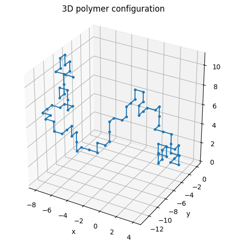

# Stochastic Polymer Modelling with Monte Carlo

<h3>Growth Sampling vs Metropolis Monte Carlo for Self-Avoiding Polymers</h3>

<p align="center">
  
</p>

This repository presents a qualitative and statistically grounded comparison of two Monte Carlo approaches for generating three-dimensional self-avoiding polymer chains on a cubic lattice.

- **Growth Sampling (GS)**  
  Polymer observables are estimated from independently generated chains:

  $$
  \langle A \rangle \approx \frac{1}{M} \sum_{k=1}^{M} A\!\left(\mathbf{R}^{(k)}\right)
  $$

- **Metropolis Monte Carlo (TM)**  
  Polymer configurations are sampled via a Markov chain with equilibrium weighting:
  
$$
P_{\mathrm{acc}} = \min\left(1, \frac{\pi(X')\,q(X \mid X')}{\pi(X)\,q(X' \mid X)}\right)
$$

$$
\pi(X) \propto e^{-\beta E(X)}
$$

where,

$\pi(X)$ is the equilibrium probability of configuration $X$,  
$E(X)$ is the corresponding energy, and $\beta = 1/(k_B T)$.
  
The project is designed as a **learning-focused, method-comparison study**, with emphasis on understanding how different stochastic sampling strategies influence measured polymer statistics such as radius of gyration ($R_g$), end-to-end distance ($ee$), and scaling behaviour (eq
shown below).

$$
\langle R_g \rangle \sim N^{\nu}
$$

## Project Objectives

The primary goals of this project are:

- To implement and compare two distinct Monte Carlo sampling strategies for self-avoiding walks.
- To evaluate how algorithmic choices affect equilibrium polymer statistics.
- To distinguish between **visual realism** and **statistical correctness** in Monte Carlo simulations.
- To develop a reproducible analysis workflow using replicate runs, paired comparisons, bootstrap confidence intervals, and scaling fits.

## Methods Overview

### Growth Sampling (GS)

Growth Sampling constructs polymer chains step-by-step from one end, selecting random local moves while enforcing self-avoidance. Each chain is generated independently from scratch.

This approach:

- Produces visually diverse and intuitive polymer conformations.
- Is computationally simple and efficient.
- Does not explicitly enforce equilibrium weighting over complete configurations.

### Metropolis Monte Carlo (TM)

Metropolis Monte Carlo samples complete polymer configurations using a Markov chain approach. Trial moves are proposed and accepted or rejected according to self-avoidance constraints, and equilibrium statistics are obtained after burn-in and thinning.

This approach:

- Produces correlated but reproducible configurations.
- Enables systematic sampling of an equilibrium ensemble.
- Requires careful handling of burn-in, thinning, and replicate analysis.

## Repository Structure

```text
spmmc
├── Docs
│   ├── results_and_discussions.md
│   └── conclusion.md
|
├── Images
│   └── ExamplePolymerModel.png
│
├── MC
│   ├── GS_MC.md
│   ├── GS_monte_carlo.py
│   ├── TM_MC.md
│   └── TM_monte_carlo.py
│
├── Notebook
│   └── Statistical_comparison.ipynb
│
└── README.md

```

## Analysis Workflow

All quantitative comparisons are performed in  
`Notebook/Statistical_comparison.ipynb`.

The analysis includes:

- Ensemble averages of radius of gyration ($R_g$) and end-to-end distance ($R_{ee}$)
- Replicate-based comparisons across multiple random seeds
- Paired method differences per chain length
- Bootstrap confidence intervals for mean differences
- Log–log scaling fits of $\langle R_g \rangle \sim N^{\nu}$
- Histogram and kernel density analysis of fitted scaling exponents

Only results directly supported by these analyses are discussed.

## Key Findings (Summary)

- Both GS and TM generate valid self-avoiding polymer configurations.
- Both methods show smooth, monotonic growth of $R_g$ and $R_{ee}$ with chain length.
- GS systematically produces smaller polymer size measures than TM at all $N$.
- The discrepancy between GS and TM increases with chain length.
- Bootstrap confidence intervals confirm that the differences are statistically decisive.
- Scaling fits show that GS yields consistently smaller values of the exponent $\nu$, indicating a bias toward more compact conformations.
- TM produces more stable and reproducible equilibrium statistics across replicates.

A detailed interpretation is provided in `Docs/results_and_discussions.md`, with a concise final assessment in `Docs/conclusion.md`.

## Intended Use

This project is intended for:

- Learning and teaching Monte Carlo sampling concepts
- Understanding methodological bias in stochastic simulations
- Demonstrating statistical comparison techniques in computational physics or chemistry
- Building intuition about polymer conformational ensembles

It is **not** intended as a high-performance or production-grade polymer simulation package.

## Reproducibility

- All simulations use explicit random seeds for reproducibility.
- Replicate analyses are performed to assess variability and robustness.
- Results can be regenerated by running the analysis notebook with the provided code.

## License / Usage

This project is provided for educational and exploratory purposes.  
Feel free to read, modify, and reuse the code with appropriate attribution.

## Acknowledgement

This repository represents a structured exploration of Monte Carlo sampling strategies and their consequences, with emphasis on careful statistical reasoning rather than visual intuition alone.
